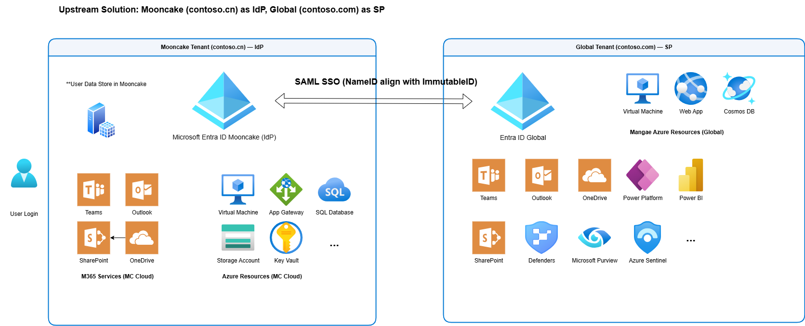

[English](Solution-Overview.en.md) | [中文](Solution-Overview.md)

# Cross-Cloud SSO 解决方案：Mooncake ⇆ Global

## 执行摘要

本解决方案为中国区客户提供了完整的跨云单点登录(SSO)架构，实现Microsoft Entra ID Mooncake与Global租户间的安全身份联合。通过SAML 2.0协议，支持双向身份认证流程，满足不同业务场景下的身份管理需求。

### 核心价值主张
- **🔒 增强安全性**: 利用全球领先的身份安全技术，实现跨云统一认证
- **🌐 合规保障**: 满足中国数据主权要求，确保身份数据本地化管理  
- **⚡ 用户体验**: 单点登录消除密码疲劳，提升工作效率
- **🤖 AI赋能转型**: 合规访问Microsoft AI产品组合，包括Azure OpenAI、Copilot Studio、Security Copilot
- **�️ 全面安全防护**: 无缝集成Defenders系列和Azure Sentinel，构建端到端安全防护体系
- **📊 智能数据治理**: 通过Microsoft Purview实现数据分类、合规监控和隐私保护
- **�🔧 灵活架构**: 支持混合云场景，适配多种业务模式和合规要求

---

## 解决方案架构

### 统一身份管理架构：Mooncake 作为身份提供者(IdP)

**最佳实践场景：总部在中国，主要业务系统部署在Mooncake，需要访问Global资源**



#### 架构优势
- **🏢 中国总部优先**: 身份管理中心在中国，符合本土化管理要求
- **🔐 统一安全控制**: Mooncake Entra ID统一管控身份认证和授权策略
- **🌍 全球资源访问**: 无缝访问Global侧M365服务和Azure资源
- **📋 合规性保障**: 核心身份数据存储在中国境内，满足数据主权要求
- **🤖 AI能力解锁**: 合规访问Azure OpenAI、Copilot Studio等前沿AI服务
- **🛡️ 企业级安全**: 集成Microsoft Defenders全家族和Azure Sentinel SIEM能力
- **📊 智能治理**: 通过Microsoft Purview实现跨云数据治理和合规监控
- **🔒 端到端加密**: 数据传输和存储全程加密，确保安全合规

#### 核心认证流程
1. **身份认证**: 用户在Mooncake Entra ID完成身份认证（含MFA/条件访问）
2. **SAML联合**: Mooncake作为IdP向Global租户发送SAML断言
3. **权限分配**: 用户获得Global侧Azure资源和企业应用访问权限
4. **统一体验**: 单点登录实现跨云无缝工作体验

#### 支持的服务范围

**Mooncake侧核心服务（身份源）：**
- Microsoft Entra ID（统一身份管理中心）
- Teams、Outlook、SharePoint、OneDrive（M365协作平台）
- Virtual Machine、Application Gateway、SQL Database（Azure基础设施）
- Storage Account、Key Vault（数据和安全服务）

**Global侧扩展服务（联合目标）：**
- **Microsoft 365全套服务**（Teams、Outlook、SharePoint、OneDrive）
- **Azure AI平台**（Azure OpenAI、AI Foundry、Machine Learning）
- **Copilot产品家族**（Microsoft 365 Copilot、Security Copilot、Copilot Studio）
- **安全运营中心**（Azure Sentinel、Microsoft Defenders全系列）
- **数据治理平台**（Microsoft Purview、Power BI）
- **企业应用程序和SaaS服务**
- **Azure全球区域资源**（计算、存储、网络、数据库）

---

## 🚀 数字化与AI转型加速器

### AI能力全面解锁
通过这个跨云SSO架构，中国企业可以在完全合规的前提下，充分利用Microsoft全球AI产品组合：

#### 🤖 生成式AI平台
- **Azure OpenAI Service**: 访问GPT-4、DALL-E、Codex等前沿大语言模型
- **AI Foundry**: 构建、部署和管理企业级AI应用
- **Copilot Studio**: 创建定制化的AI助手和智能工作流

#### 🧠 Microsoft Copilot生态
- **Microsoft 365 Copilot**: AI赋能的办公协作体验
- **Security Copilot**: AI驱动的安全运营和威胁分析
- **GitHub Copilot**: AI辅助编程和开发效率提升

### 🛡️ 零信任安全架构
基于身份联合的安全防护体系，实现全面的企业安全保障：

#### Microsoft Defenders全家族
- **Defender for Cloud**: 云原生安全态势管理
- **Defender for Endpoint**: 终端检测与响应(EDR)
- **Defender for Office 365**: 邮件和协作安全
- **Defender for Identity**: 身份威胁检测与保护

#### 安全运营中心(SOC)
- **Azure Sentinel**: 云原生SIEM/SOAR平台
- **威胁情报集成**: 全球威胁数据和本地化分析
- **自动化响应**: AI驱动的安全事件处置

### 📊 智能数据治理
- **Microsoft Purview**: 跨云数据发现、分类和保护
- **合规自动化**: 数据主权和隐私法规遵循
- **敏感数据保护**: 端到端的数据生命周期管理

> 💡 **关键优势**: 用户身份数据始终保留在中国境内，同时能够安全合规地访问Microsoft全球最先进的AI和安全产品，实现数字化转型与合规要求的完美平衡。

---

## 中国境内合规建议

### 数据主权合规清单

#### ✅ 身份数据本地化
- [ ] 确保用户主身份对象存储在中国境内(Mooncake)
- [ ] 验证身份认证日志存储在符合要求的数据中心
- [ ] 建立数据分类和标记机制，区分敏感身份信息

#### ✅ 网络安全法合规
- [ ] 实施数据出境安全评估流程
- [ ] 建立跨境数据传输审计机制
- [ ] 配置适当的数据加密和传输安全措施

#### ✅ 个人信息保护法(PIPL)合规
- [ ] 获得用户明确同意进行跨境身份验证
- [ ] 建立用户身份数据访问和删除机制
- [ ] 实施数据最小化原则，仅传输必要的身份声明

#### ✅ 关键信息基础设施保护
- [ ] 评估身份系统是否属于关键信息基础设施范畴
- [ ] 实施相应等级的安全保护措施
- [ ] 建立安全事件应急响应机制

### 技术合规建议

#### 🔐 数据加密要求
```powershell
# 确保SAML断言使用强加密算法
$SamlConfig = @{
    SigningAlgorithm = "http://www.w3.org/2001/04/xmldsig-more#rsa-sha256"
    DigestAlgorithm = "http://www.w3.org/2001/04/xmlenc#sha256"
    EncryptionMethod = "http://www.w3.org/2001/04/xmlenc#aes256-cbc"
}
```

#### 🏢 组织边界控制
- 配置条件访问策略，限制特定地理位置访问
- 实施设备合规性要求
- 启用会话控制和监控

#### 📊 审计和监控
- 启用Azure AD审计日志完整记录
- 配置安全信息和事件管理(SIEM)集成
- 建立异常登录检测和响应机制

---

## 技术实施指南

### 先决条件检查清单

#### 环境准备
- [ ] Mooncake和Global租户管理员权限
- [ ] 有效的域名和SSL证书
- [ ] 网络连通性测试完成
- [ ] DNS解析配置正确

#### 许可证要求
- [ ] Azure AD Premium P1/P2许可证(支持企业应用)
- [ ] 相应的M365或Azure服务许可证
- [ ] 第三方应用SAML集成许可证(如需要)

### POC验证步骤 - 专注Upstream架构

#### Phase 1: Mooncake环境准备
```powershell
# 连接到Mooncake Entra ID环境
Connect-AzureAD -AzureEnvironmentName AzureChinaCloud

# 验证管理员权限和许可证
Get-AzureADUser -Filter "UserType eq 'Member'" | Select DisplayName, UserPrincipalName, AssignedLicenses

# 测试Mooncake端点连通性
Test-NetConnection login.chinacloudapi.cn -Port 443
Test-NetConnection graph.chinacloudapi.cn -Port 443
```

#### Phase 2: SAML联合配置 (Mooncake作为IdP)
- [ ] 在Mooncake创建企业应用程序
- [ ] 配置SAML IdP设置和元数据
- [ ] 设置用户属性声明规则
- [ ] 导出SAML元数据给Global租户

#### Phase 3: Global租户SP配置
- [ ] 在Global租户添加外部身份提供者
- [ ] 导入Mooncake SAML元数据
- [ ] 配置域邀请和B2B协作策略
- [ ] 设置条件访问和权限控制

#### Phase 4: 端到端SSO验证
- [ ] 用户从Mooncake登录访问Global资源
- [ ] 验证M365服务(Teams/Outlook/SharePoint)访问
- [ ] 测试Azure资源访问权限
- [ ] 验证单点登录和单点注销功能

#### Phase 5: 安全和合规验证
- [ ] 条件访问策略在Mooncake端生效
- [ ] MFA和身份保护功能正常
- [ ] 审计日志跨云记录完整
- [ ] 数据本地化合规性确认

---

## 与其他方案对比

| 对比维度 | Upstream SSO (本推荐方案) | Downstream SSO | Cross-Cloud B2B (CCB2B) |
|---------|----------------------|---------------|----------------------|
| **身份中心** | Mooncake Entra ID | Global Entra ID | 分布式，两端都有用户对象 |
| **技术协议** | SAML 2.0 联合身份 | SAML 2.0 联合身份 | Microsoft Graph B2B邀请API |
| **用户体验** | 🌟 最佳：从中国账号登录 | 一般：需要海外账号 | 复杂：需要接受B2B邀请 |
| **管理复杂度** | 🌟 简单：中国总部集中管理 | 中等：海外总部管理 | 复杂：分布式管理 |
| **合规优势** | 🌟 最优：核心身份数据在中国 | 一般：身份数据在海外 | 风险：用户数据复制 |
| **适用场景** | 🎯 中国总部企业 | 海外总部中国分支 | 跨组织协作 |
| **实施难度** | 🌟 相对简单 | 中等 | 复杂 |

### 🏆 为什么选择Upstream SSO架构？

1. **🇨🇳 中国企业友好**: 身份管理中心在中国，符合中国企业管理习惯
2. **🔒 数据主权保障**: 核心用户身份数据存储在中国境内
3. **⚡ 最佳用户体验**: 员工使用熟悉的中国区账号实现全球访问
4. **📋 合规性最优**: 满足最严格的中国数据保护要求
5. **💼 管理成本低**: 统一的身份管理，降低IT运维复杂度

---

## 常见问题解答(FAQ)

### 🔧 技术实施类问题

**Q1: 为什么推荐Upstream架构而不是Downstream？**
A: 
对于中国总部企业：
- ✅ 员工已熟悉Mooncake账号，无需额外培训
- ✅ 身份数据本地化，满足中国数据主权要求
- ✅ Mooncake Entra ID功能完整，支持高级安全特性
- ✅ 更好的网络连接性能（中国用户访问中国服务）

**Q2: SAML断言的安全性如何保障？**
A: 
- 🔐 使用SHA-256强加密算法进行数字签名
- ⏰ 配置5-10分钟断言有效期防止重放攻击
- 🛡️ 启用断言加密传输保护敏感信息
- 🔄 定期轮换签名证书确保长期安全

**Q3: 支持哪些类型的应用集成？**
A:
- ✅ 支持SAML 2.0的企业应用(Salesforce、ServiceNow等)
- ✅ OpenID Connect/OAuth 2.0应用  
- ✅ Azure原生服务和资源(全球所有区域)
- ✅ 自开发的Web应用
- ✅ Microsoft 365全套服务
- ❌ 不支持传统的基于表单认证的遗留应用

**Q4: 用户属性如何在跨云间映射？**
A:
```json
{
  "StandardClaims": {
    "NameID": "user.userprincipalname", 
    "Email": "user.mail",
    "DisplayName": "user.displayname",
    "Department": "user.department",
    "JobTitle": "user.jobtitle"
  },
  "CustomAttributes": {
    "EmployeeID": "user.employeeid",
    "CostCenter": "extension_xxxxx_CostCenter"
  }
}
```

### 🏢 业务场景类问题

**Q4: 方案是否支持多租户环境？**
A: 是的，支持以下模式：
- 一对一：单个MC租户连接单个Global租户
- 一对多：单个MC租户连接多个Global租户  
- 多对一：多个MC租户连接单个Global租户(需要额外配置)

**Q5: 用户离职时如何处理访问权限？**
A:
1. 在源租户(IdP)禁用用户账户
2. SAML断言立即失效，无法访问目标资源
3. 现有会话根据配置的超时策略自动失效
4. 目标租户无需单独维护用户状态

**Q6: 是否影响现有的M365使用？**
A: 不影响。M365工作负载仍在各自云边界内运行：
- Mooncake侧：Teams/Outlook/SharePoint在contoso.cn域内
- Global侧：Teams/Outlook/SharePoint在contoso.com域内
- 跨云访问仅适用于企业应用和Azure资源

### 🔒 安全合规类问题

**Q7: 如何满足中国数据主权要求？**
A:
- 用户主身份数据存储在Mooncake(中国境内)
- 仅必要的身份声明跨境传输
- 支持数据出境安全评估和审计
- 提供详细的数据流向文档

**Q8: 发生安全事件时如何响应？**
A:
1. **检测**: Azure AD Identity Protection自动检测异常
2. **阻断**: 条件访问策略自动阻止可疑访问
3. **调查**: 通过审计日志追踪完整的认证链路  
4. **恢复**: 撤销特定会话或全面重置用户凭据

**Q9: 如何监控跨云访问活动？**
A:
- Azure AD审计日志记录所有SAML事务
- 集成Azure Sentinel进行高级威胁检测
- 自定义监控大盘显示跨云访问趋势
- 配置异常访问告警和自动响应

### 💰 成本和许可证问题

**Q10: 需要哪些许可证？**
A:
- **最低要求**: Azure AD Free (基础SAML功能)
- **推荐配置**: Azure AD Premium P1 (条件访问、审计)
- **企业级**: Azure AD Premium P2 (身份保护、PIM)
- **应用许可**: 根据集成的具体应用确定

**Q11: 方案的总体拥有成本(TCO)如何？**
A:
- **初期投入**: 中等(主要为实施服务和测试成本)
- **运营成本**: 低(自动化程度高，管理开销小)
- **相比替代方案**: 比维护双套身份系统成本更低
- **ROI周期**: 通常6-12个月可收回投资

---

## 实施路线图

### Phase 1: 规划和准备 (2-3周)
- [ ] 业务需求分析和场景确认
- [ ] 技术架构设计和评审
- [ ] 合规要求评估和差距分析
- [ ] 项目团队组建和培训

### Phase 2: 环境搭建 (2-4周)  
- [ ] 测试环境配置
- [ ] 基础连通性建立
- [ ] 证书和安全配置
- [ ] 初步功能验证

### Phase 3: 应用集成 (3-6周)
- [ ] 优先级应用SAML集成
- [ ] 用户属性映射配置
- [ ] 访问策略和权限设置
- [ ] 用户接受度测试

### Phase 4: 生产部署 (2-3周)
- [ ] 生产环境配置
- [ ] 用户迁移和培训
- [ ] 监控和告警设置
- [ ] 上线支持和优化

### Phase 5: 运营优化 (持续)
- [ ] 性能监控和调优
- [ ] 安全策略持续改进
- [ ] 用户反馈收集和改进
- [ ] 新应用和场景扩展

---

## 支持资源

### 技术文档
- [详细实施指南](MC-Mooncake-SSO-with-Global-Tenant-SAML.md)
- [PowerShell自动化脚本](../AutomationScripts/)
- [架构图源文件](./assets/)

### 联系支持
- **Microsoft中国技术支持**: 通过Azure门户提交支持票据
- **合作伙伴支持**: 联系您的Microsoft合作伙伴
- **社区支持**: Microsoft Tech Community

---

*最后更新：2025年10月*


