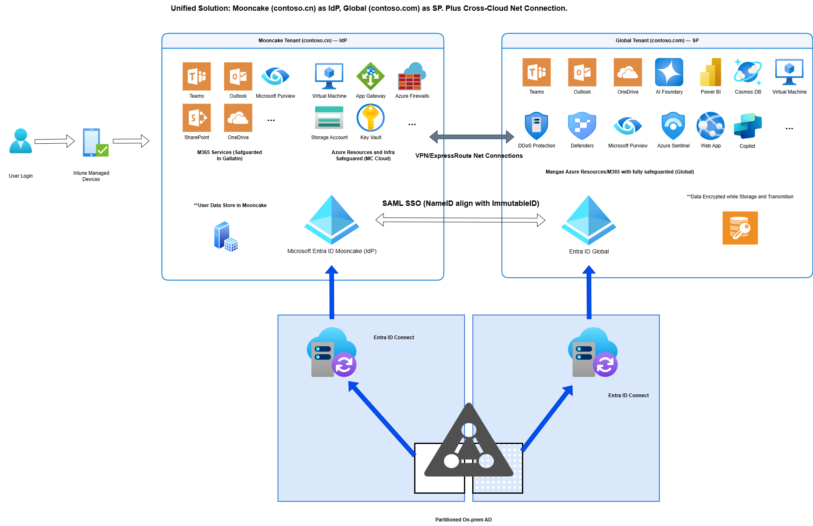

[English](Solution-Overview.en.md) | [中文](Solution-Overview.md)

# Cross-Cloud SSO 解决方案：Mooncake ⇆ Global

## 执行摘要

本解决方案为中国区客户提供了完整的跨云单点登录(SSO)架构，实现Microsoft Entra ID Mooncake与Global租户间的安全身份联合。通过SAML 2.0协议，支持双向身份认证流程，满足不同业务场景下的身份管理需求。

### 核心价值主张
- 增强安全性: 利用全球领先的身份安全技术，实现跨云统一认证
- 合规保障: 满足中国数据主权要求，确保身份数据本地化管理  
- 用户体验: 单点登录消除密码疲劳，提升工作效率
- AI赋能转型: 合规访问Microsoft AI产品组合，包括Azure OpenAI、Copilot Studio、Security Copilot
- 全面安全防护: 无缝集成Defenders系列和Azure Sentinel，构建端到端安全防护体系
- 智能数据治理: 通过Microsoft Purview实现数据分类、合规监控和隐私保护
- 灵活架构: 支持混合云场景，适配多种业务模式和合规要求

---

## 角色视角解决方案表格

| 角色                | 英文概述链接                                   | 中文概述链接                                   |
|---------------------|-----------------------------------------------|-----------------------------------------------|
| CIO (首席信息官)      | [CIO Overview (EN)](Solution-Overview-CIO.en.md)      | [CIO 概述 (中文)](Solution-Overview-CIO.md)      |
| CISO (首席信息安全官) | [CISO Overview (EN)](Solution-Overview-CISO.en.md)    | [CISO 概述 (中文)](Solution-Overview-CISO.md)    |
| 安全经理             | [Security Manager Overview (EN)](Solution-Overview-SecurityManager.en.md) | [安全经理概述 (中文)](Solution-Overview-SecurityManager.md) |
| CFO (首席财务官) | [CFO Overview (EN)](Solution-Overview-CFO.en.md) | [CFO 概述 (中文)](Solution-Overview-CFO.md) |

---

### CIO视角

**数字化转型与业务价值**
- 通过跨云SSO架构加速企业数字化转型，支持全球业务扩展与本地合规。
- 实现中国区与全球区资源的无缝访问，提升员工生产力和协作效率。
- 合规接入Microsoft AI产品（如Copilot、OpenAI），推动创新和智能化办公。
- 灵活架构支持多种业务模式，降低IT运维复杂度和成本。
- 通过ExpressRoute/VPN实现安全、稳定的跨云连接，保障关键业务连续性。

**关键目标与关注点（KOI）：**
- 投资回报率（ROI）、业务敏捷性、合规、创新能力、数字化领导力
**动因：**
- 推动转型、支持全球增长、降低运营风险、赋能团队

---

### CISO视角

**安全与合规保障**
- 端到端身份安全架构，支持多因素认证、条件访问和零信任模型。
- 核心身份数据本地化，满足中国数据主权和合规要求。
- 集成Microsoft Defenders、Sentinel、Purview等安全产品，实现威胁检测、响应和数据治理。
- 网络层安全：支持ExpressRoute/VPN，保障跨云数据传输加密和隔离。
- 完善的审计、监控和合规报告，支持安全事件响应和合规审查。

**关键目标与关注点（KOI）：**
- 数据主权、威胁防护、合规性、可审计性、风险管理
**动因：**
- 降低风险、确保合规、保护企业资产、支持安全创新

---

### 安全经理视角

**日常安全运营与管理**
- 简化身份管理流程，统一跨云用户认证和权限分配。
- 自动化安全策略和合规检查，提升运维效率。
- 通过SIEM/SOAR平台（Sentinel）集中监控和告警，快速响应安全事件。
- 支持多种网络连接方式（ExpressRoute/VPN），灵活适配企业现有网络架构。
- 提供详细的操作指南和自动化脚本，降低人为失误风险。

**关键目标与关注点（KOI）：**
- 运维效率、自动化、监控与告警、操作可控性、事件响应
**动因：**
- 简化日常运维、减少人工工作量、提升响应速度、保持合规

---

### CFO视角

**财务优化与风险管控**
- 通过统一的跨云架构优化IT和安全支出，减少重复和管理成本。
- 实现云资源和安全投资的成本透明与可预测性。
- 支持合规驱动的成本规避（罚款、审计失败）和业务连续性。
- 利用微软全球规模优势，获得更优定价、许可和支持。
- 支持数字化转型和AI应用的财务规划。

**关键目标与关注点（KOI）：**
- 成本控制、财务透明、风险规避、合规成本规避、价值实现
**动因：**
- 最大化ROI、最小化财务风险、支持战略增长、确保预算匹配

---

## 解决方案架构

### 统一身份管理架构：Mooncake 作为身份提供者(IdP)

**最佳实践场景：总部在中国，主要业务系统部署在Mooncake，需要访问Global资源**

#### 架构优势
1. **中国总部优先**：身份管理中心在中国，符合本土化管理要求
2. **统一安全控制**：Mooncake Entra ID统一管控身份认证和授权策略
3. **全球资源访问**：无缝访问Global侧M365服务和Azure资源
4. **灵活连接选项**：支持VPN网关和ExpressRoute等多种安全跨云连接方式
5. **合规性保障**：核心身份数据存储在中国境内，满足数据主权要求
6. **AI能力解锁**：合规访问Azure OpenAI、Copilot Studio等前沿AI服务
7. **企业级安全**：集成Microsoft Defenders全家族和Azure Sentinel SIEM能力
8. **智能治理**：通过Microsoft Purview实现跨云数据治理和合规监控
9. **端到端加密**：数据传输和存储全程加密，确保安全合规
10. **性能优化**：通过ExpressRoute专用网络路径提升性能和可靠性

#### 核心认证流程
1. **身份认证**: 用户在Mooncake Entra ID完成身份认证（含MFA/条件访问）
2. **网络连接**: 通过VPN网关或ExpressRoute连接确保安全通信
3. **SAML联合**: Mooncake作为IdP通过安全网络通道向Global租户发送SAML断言
4. **权限分配**: 用户获得Global侧Azure资源和企业应用访问权限
5. **统一体验**: 单点登录实现跨云无缝工作体验，网络性能优化

#### 支持的服务范围

**Mooncake侧核心服务（身份源）：**
- Microsoft Entra ID（统一身份管理中心）
- Teams、Outlook、SharePoint、OneDrive（M365协作平台）
- Virtual Machine、Application Gateway、SQL Database（Azure基础设施）
- Storage Account、Key Vault（数据和安全服务）

**Global侧扩展服务（联合目标）：**
- Microsoft 365全套服务（Teams、Outlook、SharePoint、OneDrive）
- Azure AI平台（Azure OpenAI、AI Foundry、Machine Learning）
- Copilot产品家族（Microsoft 365 Copilot、Security Copilot、Copilot Studio）
- 安全运营中心（Azure Sentinel、Microsoft Defenders全系列）
- 数据治理平台（Microsoft Purview、Power BI）
- **企业应用程序和SaaS服务**
- **Azure全球区域资源**（计算、存储、网络、数据库）

---

## � 网络连接选项

### 安全跨云连接
网络连接选项
架构支持多种网络连接选项，确保Mooncake和Global云之间的安全、可靠和高性能通信：

VPN网关连接
站点到站点VPN: 标准连接需求的安全IPsec隧道
点到站点VPN: 远程访问场景的个人客户端连接
成本效益: 适用于中等带宽要求和测试环境
简易设置: 标准互联网连接快速部署

ExpressRoute连接
专用私有电路: 直接连接到Microsoft云服务
高性能: 保证带宽和更低延迟
增强安全: 绕过公共互联网的私有连接
SLA保证: Microsoft SLA覆盖的99.95%可用性
法规合规: 满足严格的数据主权和安全要求

混合安全优势
流量隔离: 专用网络路径与公共互联网分离
增强监控: 跨云流量流动的完整可见性
条件访问集成: 网络感知的访问策略
零信任架构: 网络安全作为综合身份保护的组成部分
---

## �🚀 数字化与AI转型加速器

### AI能力全面解锁
通过这个跨云SSO架构，中国企业可以在完全合规的前提下，充分利用Microsoft全球AI产品组合：

#### 🤖 生成式AI平台
- **Azure OpenAI Service**: 访问GPT-4、DALL-E、Codex等前沿大语言模型
- **AI Foundry**: 构建、部署和管理企业级AI应用
- **Copilot Studio**: 创建定制化的AI助手和智能工作流

#### 🧠 Microsoft Copilot生态
- **Microsoft 365 Copilot**: AI赋能的办公协作体验
- **Security Copilot**: AI驱动的安全运营和威胁分析
- **GitHub Copilot**: AI辅助编程和开发效率提升

### 🛡️ 零信任安全架构
基于身份联合的安全防护体系，实现全面的企业安全保障：

#### Microsoft Defenders全家族
- **Defender for Cloud**: 云原生安全态势管理
- **Defender for Endpoint**: 终端检测与响应(EDR)
- **Defender for Office 365**: 邮件和协作安全
- **Defender for Identity**: 身份威胁检测与保护

#### 安全运营中心(SOC)
- **Azure Sentinel**: 云原生SIEM/SOAR平台
- **威胁情报集成**: 全球威胁数据和本地化分析
- **自动化响应**: AI驱动的安全事件处置

### 📊 智能数据治理
- **Microsoft Purview**: 跨云数据发现、分类和保护
- **合规自动化**: 数据主权和隐私法规遵循
- **敏感数据保护**: 端到端的数据生命周期管理

> 💡 **关键优势**: 用户身份数据始终保留在中国境内，同时能够安全合规地访问Microsoft全球最先进的AI和安全产品，实现数字化转型与合规要求的完美平衡。
关键优势: 用户身份数据始终保留在中国境内，同时能够安全合规地访问Microsoft全球最先进的AI和安全产品，实现数字化转型与合规要求的完美平衡。

---

## 中国境内合规建议

### 数据主权合规清单

#### ✅ 身份数据本地化
- [ ] 确保用户主身份对象存储在中国境内(Mooncake)
- [ ] 验证身份认证日志存储在符合要求的数据中心
- [ ] 建立数据分类和标记机制，区分敏感身份信息

#### ✅ 网络安全法合规
- [ ] 实施数据出境安全评估流程
- [ ] 建立跨境数据传输审计机制
- [ ] 配置适当的数据加密和传输安全措施

#### ✅ 个人信息保护法(PIPL)合规
- [ ] 获得用户明确同意进行跨境身份验证
- [ ] 建立用户身份数据访问和删除机制
- [ ] 实施数据最小化原则，仅传输必要的身份声明

#### ✅ 关键信息基础设施保护
- [ ] 评估身份系统是否属于关键信息基础设施范畴
- [ ] 实施相应等级的安全保护措施
- [ ] 建立安全事件应急响应机制

### 技术合规框架

本解决方案在满足中国监管要求的同时，支持全球Microsoft服务访问：

#### 数据主权保护
- 身份数据本地化: 用户主身份对象始终保留在中国境内(Mooncake)
- 受控数据流: 仅必要的认证令牌跨境传输，非用户数据本身
- 审计跟踪: 跨境身份认证活动的完整可见性

#### 法规遵循
- 网络安全法: 合规的数据处理和安全评估流程
- 个人信息保护法: 用户同意机制和数据最小化原则
- 关键信息基础设施: 企业系统适当的安全保护等级

#### 安全控制
- 强身份认证: 多因素认证和条件访问策略
- 持续监控: 实时安全分析和事件响应
- 零信任架构: 以身份为中心的安全模型，最小权限访问

---

## 下一步行动

如需详细技术实施指导，请参考我们的完整文档：

- **[技术实施指南](MC-Mooncake-SSO-with-Global-Tenant-SAML.md)** - 完整的SAML联合设置说明
- **[中国合规检查清单](China-Compliance-Checklist.md)** - 监管合规框架
- **[PowerShell自动化脚本](../AutomationScripts/)** - 即用型部署自动化
- **[架构图资源](./assets/)** - 详细技术架构资源

### 解决方案对比

| 方面 | Cross-Cloud SSO | Cross-Cloud B2B (CCB2B) |
|------|-----------------|-------------------------|
| **身份模型** | 联合身份管理 | 来宾用户协作 |
| **用户体验** | 无缝单点登录 | 基于邀请的访问 |
| **管理方式** | 集中身份控制 | 分布式来宾管理 |
| **合规性** | 源租户数据驻留 | 跨租户数据复制 |
| **主要用例** | 企业内部访问 | 跨组织资源共享 |

### 实施方法

本解决方案采用分阶段部署方法：

1. **规划与评估** - 业务需求和合规分析
2. **试点环境** - 测试环境搭建和验证
3. **应用集成** - 优先服务联合
4. **生产部署** - 大规模推广和监控
5. **持续优化** - 改进和扩展

---

## 支持资源

### 技术文档
- [详细实施指南](MC-Mooncake-SSO-with-Global-Tenant-SAML.md)
- [PowerShell自动化脚本](../AutomationScripts/)
- [架构图源文件](./assets/)

### 联系支持
- Microsoft中国技术支持: 通过Azure门户提交支持票据
- 合作伙伴支持: 联系您的Microsoft合作伙伴
- 社区支持: Microsoft Tech Community

---

*最后更新：2025年10月*

